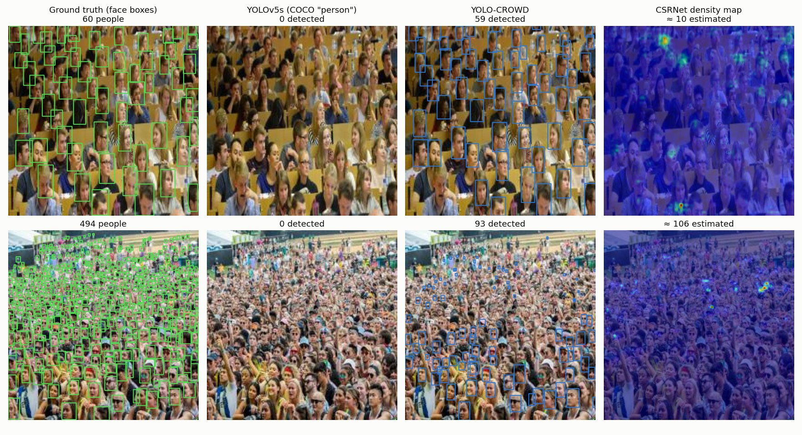
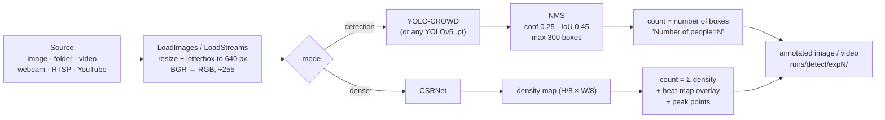
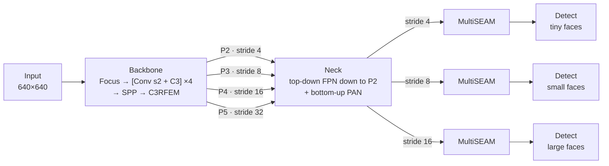
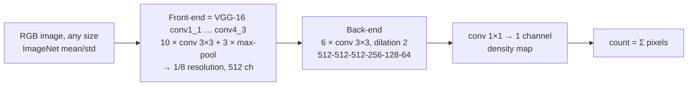
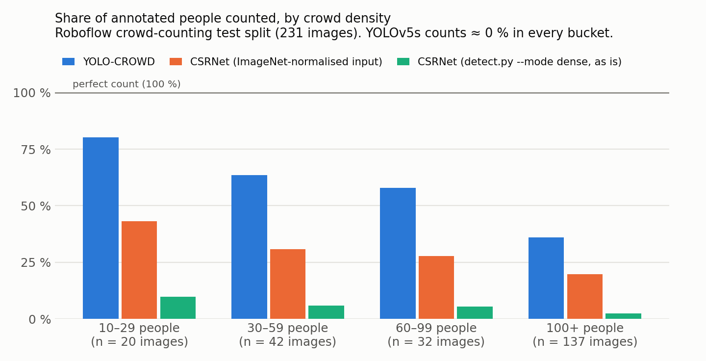

# YOLO-CROWD vs CSRNet: crowd counting by detection and by density estimation

This seminar project compares the two main ways of counting people in crowd images:

| | **Detection** (YOLO-CROWD) | **Density estimation** (CSRNet) |
|---|---|---|
| Idea | Find every face/head and draw a box, then count the boxes | Predict a density map and take its integral |
| Output | One box per person, plus a confidence score | A heat-map at 1/8 resolution, plus a count |
| Strong at | Sparse to medium crowds, localisation, tracking | Very dense crowds with tiny heads |
| Weak at | Heavy occlusion, tiny heads, hard cap of 300 boxes | Sparse scenes, domain shift, no per-person output |

Both models run from the same command-line tool (`detect.py --mode detection | dense`). The repository also contains the training code for YOLO-CROWD, the notebooks we used, a counting benchmark, and our experimental remarks.

> The project is a fork of [zaki1003/YOLO-CROWD](https://github.com/zaki1003/YOLO-CROWD), which is built on [Ultralytics YOLOv5 v5.0](https://github.com/ultralytics/yolov5/tree/v5.0) and the face-detection modules of [YOLO-FaceV2](https://github.com/Krasjet-Yu/YOLO-FaceV2). We added the CSRNet dense mode, fixed compatibility with recent PyTorch, NumPy and macOS, ran the comparison experiments and wrote this documentation.

> 📄 **Full report:** for the complete study, read our seminar report [*Crowd Counting based on AI techniques*](docs/SEMINAIRE.pdf) (École Nationale Polytechnique, 2025, 45 pages). It covers conventional counting methods, AI-based methods, and our approach and experiments in more detail than this README.


<sub>Two images from the test split of the Roboflow crowd dataset. Top row: 60 people. YOLO-CROWD finds 59 and a generic YOLOv5s finds none. Bottom row: 494 people. Every model under-counts here, and detection breaks down in the far, tiny rows.</sub>

---

## Contents

1. [Key findings](#1-key-findings)
2. [Repository structure](#2-repository-structure)
3. [How it works](#3-how-it-works)
   - [3.1 Inference pipeline](#31-inference-pipeline-detectpy)
   - [3.2 YOLO-CROWD architecture](#32-yolo-crowd-architecture)
   - [3.3 CSRNet architecture](#33-csrnet-architecture)
4. [Installation](#4-installation)
5. [Weights and dataset](#5-weights-and-dataset)
6. [Usage](#6-usage)
7. [YOLO vs CSRNet: experiments and remarks](#7-yolo-vs-csrnet-experiments-and-remarks)
8. [Changes compared with upstream](#8-changes-compared-with-upstream)
9. [Known issues and limitations](#9-known-issues-and-limitations)
10. [Upstream YOLO-CROWD results](#10-upstream-yolo-crowd-results)
11. [References, credits and license](#11-references-credits-and-license)

---

## 1. Key findings

- **A generic detector is not a crowd counter.** COCO YOLOv5s matches the manual count on a posed group photo (24 vs ~24). It finds only 15 of ~66 people in an auditorium and 14 of ~170 in a dense crowd. On the 231-image test set it finds almost nobody.
- **YOLO-CROWD handles sparse and medium crowds very well.** It counted 25 vs ~24, 67 vs ~66 and 168 vs ~170 on our own photos, and it has the lowest error of all models in every density range of the test set.
- **Detection saturates as density grows.** YOLO-CROWD counts 80 % of the annotated faces when there are 10–29 people, but only 36 % when there are more than 100. Non-maximum suppression (NMS) also caps the count at **300**.
- **CSRNet has no ceiling, but it needs the right input and domain.** On a stadium photo it estimates thousands where YOLO-CROWD finds 147. Out of its training domain it is poorly calibrated: it over-counts sparse scenes and under-counts the low-resolution Roboflow images.
- **Pre-processing matters as much as the model.** With the same CSRNet weights, the stadium count is **42** when the input is not normalised (the current `detect.py`) and **4,827** with ImageNet normalisation. See [known issue #1](#9-known-issues-and-limitations).
- **Speed on an Apple M1 CPU:** YOLO-CROWD takes about 230 ms per image and CSRNet about 2 s. On a GPU, YOLO-CROWD runs in real time.

---

## 2. Repository structure

The weights (`*.pt`, `*.pth`) and the dataset (`yolo_test/`) are not in git. Download them as one zip from Google Drive and unzip it in the repository root (see [section 5](#5-weights-and-dataset)). Run outputs (`runs/`) are git-ignored too.

---

## 3. How it works

### 3.1 Inference pipeline (`detect.py`)



**Detection mode** (the default) runs YOLO-CROWD, or any YOLOv5 checkpoint, on the letterboxed frame. It filters the predictions with NMS, draws one box per person without a label, and writes `Number of people=N` in the top-left corner. With `--save-txt` it also saves the boxes in YOLO format.

**Dense mode** (`--mode dense`) runs CSRNet and post-processes the density map:

1. **Count**: `Crowd = int(Σ density)`.
2. **Heat-map**: the density map is upsampled to the frame size, min-max normalised, coloured with `COLORMAP_JET` and blended at α = 0.5.
3. **Peak points**: a rough position for each person.
   - Adaptive threshold `t = max(mean + 0.5·std, 0.15·max)` over the non-zero pixels.
   - Local maxima with `scipy.ndimage.maximum_filter`, window `clip(min(H, W)/40, 15, 30)` px.
   - Peaks inside a border of half the window are dropped.
   - Each peak is drawn as a green dot, and `Points = number of peaks`.

`Crowd` (the integral) is the actual CSRNet estimate. `Points` is a heuristic for visualisation, and the two can disagree. On a dense street image, for example, we got Crowd = 98 and Points = 122.

### 3.2 YOLO-CROWD architecture

YOLO-CROWD is YOLOv5s (depth × 0.33, width × 0.50) with three changes taken from YOLO-FaceV2. Each change targets small, occluded faces. The model has a single class, `people`, and the boxes are drawn around faces or heads. It has **18,388,982 parameters** and **461 modules** (18,380,054 parameters after Conv-BN fusion), as checked by loading `yolo-crowd.pt`.



| Component | Where | What it does | Why it helps crowds |
|---|---|---|---|
| **Detection heads at P2/P3/P4** | `yolo_crowd.yaml`, head layers 18–27 | The FPN is extended down to the stride-4 feature map (it concatenates with backbone layer 2), and the outputs are taken at strides **4, 8 and 16** instead of the usual 8, 16 and 32 | Faces 4–10 px wide still fall on several grid cells. The stride-32 head, which is useless for crowds, is removed |
| **RFE: Receptive Field Enhancement** (`RFEM`, `C3RFEM`) | `models/common.py`, last backbone stage after SPP | A TridentNet-style block. One shared 1×1 → 3×3 kernel is applied in three branches with dilation 1, 2 and 3. The branches are summed with a residual, then passed through BN and SiLU | Gives several receptive fields with no extra weights, so one feature map can describe faces of very different scales |
| **MultiSEAM: Separated and Enhancement Attention** | `models/common.py`, one module on each output level | Three patch-embedding branches (conv with kernel = stride = 6, 7 and 8), each followed by a depthwise residual conv and a pointwise conv. The branches are average-pooled together with the input, passed through an FC bottleneck (÷16) and a sigmoid, then `exp()`. The result rescales the channels by a factor between 1 and e | Re-weights the channels towards features that survive occlusion, such as the visible part of a face, so that partly hidden faces keep a high score |
| **Small anchors** | stored in `yolo-crowd.pt` | `autoanchor` replaced the RetinaFace anchors listed in the YAML with 9 anchors from ≈4×6 px to ≈34×55 px, fitted by k-means to the dataset | Matches the tall, tiny face boxes of the dataset |
| **Loss** | `utils/loss.py` | CIoU box loss + BCE objectness, with level weights 4.0 / 1.0 / 0.4. There is no class loss because nc = 1 | Standard YOLOv5 loss (see [known issue #9](#9-known-issues-and-limitations)) |

The upstream model was trained with `--img 416 --batch 16 --epochs 200 --weights yolov5s.pt` and `data/hyp.scratch.yaml` (SGD, lr0 = 0.01, one-cycle schedule, mosaic augmentation).

<details>
<summary>Layer-by-layer config (<code>models/yolo_crowd.yaml</code>)</summary>

| # | From | Module | Args (before width scaling) | Output stride |
|---|---|---|---|---|
| 0 | -1 | Focus | 64, k3 | 2 |
| 1 | -1 | Conv | 128, k3, s2 | 4 (P2) |
| 2 | -1 | C3 ×1 | 128 | 4 |
| 3 | -1 | Conv | 256, k3, s2 | 8 (P3) |
| 4 | -1 | C3 ×3 | 256 | 8 |
| 5 | -1 | Conv | 512, k3, s2 | 16 (P4) |
| 6 | -1 | C3 ×3 | 512 | 16 |
| 7 | -1 | Conv | 1024, k3, s2 | 32 (P5) |
| 8 | -1 | SPP | 1024, [5, 9, 13] | 32 |
| 9 | -1 | **C3RFEM** ×1 | 1024 | 32 |
| 10–13 | 9 → up → cat 6 | Conv, Upsample, Concat, C3 | 512 | 16 |
| 14–17 | → up → cat 4 | Conv, Upsample, Concat, C3 | 256 | 8 |
| 18–21 | → up → cat 2 | Conv, Upsample, Concat, C3 | 128 | **4** |
| 22–24 | → Conv s2 → cat 18 | Conv, Concat, C3 | 256 | **8** |
| 25–27 | → Conv s2 → cat 14 | Conv, Concat, C3 | 512 | **16** |
| 28–33 | 21, 24, 27 | **MultiSEAM** + 1×1 Conv on each | 128 / 256 / 512 | 4 / 8 / 16 |
| 34 | 29, 31, 33 | Detect | nc = 1, 3 anchors per level | 4 / 8 / 16 |

The YAML comments say "P3/P4/P5". The real strides, from `model.stride`, are 4, 8 and 16.
</details>

### 3.3 CSRNet architecture

CSRNet ([Li et al., CVPR 2018](https://arxiv.org/abs/1802.10062)) is a fully convolutional density-map regressor with **16,263,489 parameters**.



- **Dilated convolutions** enlarge the receptive field without more pooling. The map stays at 1/8 resolution, which is enough to separate neighbouring heads.
- **Training target**: every annotated head point becomes a small Gaussian whose integral is 1, so the sum of the map equals the number of people. There is no box, NMS or detection threshold, and so no upper limit on the count.
- **Weights used here**: the public ShanghaiTech **Part A** checkpoint from [CSRNet-pytorch](https://github.com/leeyeehoo/CSRNet-pytorch) (`PartAmodel_best.pth.tar`, epoch 376, stored validation MAE **65.9**; the paper reports 68.2). `weights.pth` is its `state_dict`. Part A has 482 very dense images (300 for training and 182 for testing), with about 500 people per image on average.
- `notebooks/CSRNet_ShanghaiTech_eval.ipynb` runs the model on the Part A test image `IMG_10`: it predicts **427.1** against **502** in the ground truth.

---

## 4. Installation

```bash
git clone https://github.com/hyper-quack/Crowd-Counting-Detection-and-Density.git
cd YOLO-CROWD

python -m venv .venv && source .venv/bin/activate      # or: conda create -n yolo-crowd python=3.11
pip install -r requirements.txt
pip install yt-dlp                                     # optional, for YouTube sources

# then download YOLO-CROWD-assets.zip (weights + dataset) and unzip it here, see section 5
```

We tested with Python 3.14.2, PyTorch 2.10.0, torchvision 0.25.0, NumPy 2.4.2, OpenCV 4.13.0 and SciPy 1.17.0 on macOS (Apple M1). The upstream code was written for PyTorch 1.7–1.11. The fixes listed in [section 8](#8-changes-compared-with-upstream) let it run on PyTorch ≥ 2.6 and NumPy ≥ 2.

Docker: the `Dockerfile` (NVIDIA PyTorch 21.03 base image) comes from upstream YOLOv5 and has not been updated.

---

## 5. Weights and dataset

The trained models and the dataset are too large for GitHub, so they are shared as **one zip on Google Drive**.

### Quick setup: download the assets bundle (recommended)

**[⬇ Download `YOLO-CROWD-assets.zip` from Google Drive](https://drive.google.com/file/d/1w90i1fwjIGH7GWwjarWne31unL5rj5fY/view?usp=sharing)** (313 MB, 356 MB unzipped)

| Inside the zip | What it is | Size |
|---|---|---|
| `yolo-crowd.pt` | YOLO-CROWD weights (detection mode) | 37 MB |
| `yolov5s.pt` | YOLOv5s v5.0 COCO weights (baseline and training init) | 15 MB |
| `weights.pth` | CSRNet weights, ShanghaiTech Part A (dense mode) | 65 MB |
| `yolo_test/` | Roboflow crowd dataset: 2,898 images with labels (train / valid / test) | 242 MB |

1. **Download** `YOLO-CROWD-assets.zip` with the link above.
2. **Move** it into the root of the cloned repository, the folder that contains `detect.py`.
3. **Unzip** it there:
   ```bash
   cd YOLO-CROWD                     # the repository root
   unzip YOLO-CROWD-assets.zip       # macOS / Linux
   # Windows (PowerShell): Expand-Archive YOLO-CROWD-assets.zip -DestinationPath .
   ```
   If your browser extracted the zip automatically into a `YOLO-CROWD-assets/` folder, move everything inside that folder into the repository root.
4. **Check** the layout. The three weight files must sit next to `detect.py`:
   ```
   YOLO-CROWD/
   ├── detect.py
   ├── yolo-crowd.pt
   ├── yolov5s.pt
   ├── weights.pth
   └── yolo_test/
       ├── data.yaml
       ├── train/{images,labels}
       ├── valid/{images,labels}
       └── test/{images,labels}
   ```
5. **Test** it: `python detect.py --weights yolo-crowd.pt --source data/images/bus.jpg`. The result is saved in `runs/detect/exp/`.
6. Optionally delete the zip (`rm YOLO-CROWD-assets.zip`). Git already ignores the zip, the weights and `yolo_test/`.

You can also do steps 1–3 from the command line:

```bash
pip install gdown
gdown --fuzzy "https://drive.google.com/file/d/1w90i1fwjIGH7GWwjarWne31unL5rj5fY/view?usp=sharing" -O YOLO-CROWD-assets.zip
unzip YOLO-CROWD-assets.zip
```

<details>
<summary>How the bundle was built (for maintainers)</summary>

Run this from the repository root. `.DS_Store` files are skipped, and so is `labels.cache`, which stores absolute local paths and is rebuilt automatically.

```bash
zip -r -X YOLO-CROWD-assets.zip yolo-crowd.pt yolov5s.pt weights.pth yolo_test -x "*.DS_Store" "*.cache"
```
</details>

### Alternative: original sources

If you prefer, get each file from where it was originally published and place it in the repository root.

#### Weights

| File | Model | Size | Source |
|---|---|---|---|
| `yolo-crowd.pt` | YOLO-CROWD, 1 class `people` | 37 MB | [Google Drive (upstream)](https://drive.google.com/file/d/1xxXVCzseuzmHv7NoMQ03RVU_tDisWXjM/view?usp=sharing) · TensorRT version: [yolo-crowd.engine](https://drive.google.com/file/d/1-189sscpNZBFaSHOz7dnEgAaFeUALiow/view?usp=sharing) |
| `yolov5s.pt` | YOLOv5s v5.0, COCO (baseline and training init) | 15 MB | [ultralytics/yolov5 v5.0 release](https://github.com/ultralytics/yolov5/releases/download/v5.0/yolov5s.pt) |
| `weights.pth` | CSRNet `state_dict`, ShanghaiTech Part A | 65 MB | Extract it from `PartAmodel_best.pth.tar` of [CSRNet-pytorch](https://github.com/leeyeehoo/CSRNet-pytorch) (see below), or get it from Kaggle |

```python
# PartAmodel_best.pth.tar (130 MB, includes the optimizer state) → weights.pth (65 MB)
import torch
ckpt = torch.load('PartAmodel_best.pth.tar', map_location='cpu', weights_only=False)
torch.save(ckpt['state_dict'], 'weights.pth')
```

#### Dataset

We used the Roboflow [crowd counting dataset v2](https://universe.roboflow.com/crowd-dataset/crowd-counting-dataset-w3o7w/dataset/2) (CC BY 4.0). The assets bundle redistributes it under that license, with attribution in `yolo_test/README.roboflow.txt`.

- **2,898 images**: 2,285 for training, 382 for validation and 231 for testing.
- Every image is resized to 640×640 by stretching, with auto-orientation and no augmentation.
- One class, `people`, with **one box per visible face or head**.
- The test split has 197 faces per image on average (median 126, min 10, max 1,212).

Export the dataset in **YOLO v5 PyTorch** format and unzip it into `yolo_test/`, so that `data/crowd.yaml` resolves:

```
yolo_test/
├── train/{images,labels}
├── valid/{images,labels}
└── test/{images,labels}
```

---

## 6. Usage

### Inference

```bash
# YOLO-CROWD (detection mode, default)
python detect.py --weights yolo-crowd.pt --source path/to/image.jpg
python detect.py --weights yolo-crowd.pt --source path/to/folder/
python detect.py --weights yolo-crowd.pt --source video.mp4
python detect.py --weights yolo-crowd.pt --source 0 --view-img               # webcam
python detect.py --weights yolo-crowd.pt --source 'rtsp://host/stream'       # RTSP / RTMP / HTTP
python detect.py --weights yolo-crowd.pt --source 'https://youtu.be/<id>'    # YouTube (needs yt-dlp)

# CSRNet (dense mode)
python detect.py --mode dense --weights weights.pth --source path/to/image.jpg

# Baseline: vanilla COCO YOLOv5s, person class only
python detect.py --weights yolov5s.pt --classes 0 --source path/to/image.jpg
```

Results are saved to `runs/detect/expN/`, with a new folder for every run.

| Flag | Default | Meaning |
|---|---|---|
| `--mode` | `detection` | `detection` = YOLO checkpoint (`.pt`), `dense` = CSRNet `state_dict` (`.pth`) |
| `--weights` | `yolov5s.pt` | Model file |
| `--source` | `data/images` | Image, folder, glob, video, webcam index, stream URL, or `.txt` list of streams |
| `--img-size` | 640 | Inference size in pixels (detection mode; dense mode always uses 640) |
| `--conf-thres` / `--iou-thres` | 0.25 / 0.45 | NMS thresholds (detection mode) |
| `--classes` | all | Keep only these class ids. Use `--classes 0` with COCO models to count persons only |
| `--view-img` | off | Show frames in a window (also writes `./results/<name>_result.png`) |
| `--pause` | 1 ms | `cv2.waitKey()` delay per frame with `--view-img` (0 = wait for a key) |
| `--save-txt` / `--save-conf` | off | Save the boxes (and confidences) as YOLO `.txt` labels |
| `--nosave` | off | Do not save annotated images or videos |
| `--device` | auto | `cpu`, `0`, `0,1`, … (see [known issue #3](#9-known-issues-and-limitations) about Apple MPS) |
| `--project` / `--name` / `--exist-ok` | `runs/detect` / `exp` | Output folder |

### Training

```bash
python train.py --img-size 416 --batch-size 16 --epochs 200 \
                --data data/crowd.yaml --cfg models/yolo_crowd.yaml \
                --weights yolov5s.pt --name yolo_crowd_results --cache-images
```

Checkpoints, curves and the TensorBoard logs go to `runs/train/yolo_crowd_results/`. For hyper-parameter evolution, see the [YOLOv5 docs](https://github.com/ultralytics/yolov5/issues/607) (`--evolve`).

### Evaluation

```bash
# Detection metrics (P, R, mAP) on the test split
python test.py --weights yolo-crowd.pt --data data/crowd.yaml --img-size 640 --task test

# Counting benchmark (MAE / RMSE per density range) for YOLO-CROWD, YOLOv5s and CSRNet
python tools/benchmark_counting.py --split yolo_test/test --json runs/count_eval.json
```

### Export and TensorRT

`models/export.py` exports to ONNX, TorchScript and CoreML. `notebooks/Yolov5_TensortRT_Convert_and_detect.ipynb` builds a TensorRT engine. On a Tesla T4 it measured **15.1 ms** of inference per 640×640 frame (0.6 ms pre-processing, 1.8 ms NMS).

---

## 7. YOLO vs CSRNet: experiments and remarks

All the numbers below were measured with the code and weights in this repository. We used an Apple M1 CPU, batch size 1, and the default thresholds (conf 0.25, IoU 0.45). The CSRNet results are reported in two versions:

- **CSRNet (`detect.py`)** is exactly what `detect.py --mode dense` computes today: resize to 640 px, pixels ÷ 255, no normalisation.
- **CSRNet (normalised)** uses the pre-processing the model was trained with: ImageNet mean and std, with the image resized to 1024×768 as in the Kaggle notebook.

### 7.1 Field test on our own photos

These are our seminar notes. The first three columns are the ones we wrote down during the session. We re-ran every model on the same images to fill in the CSRNet columns.

| Scene | Manual count | YOLOv5s (COCO person) | **YOLO-CROWD** | CSRNet (`detect.py`) | CSRNet (normalised) |
|---|---:|---:|---:|---:|---:|
| Group photo outdoors, 4032×3024 | ~24 | 24 | **25** | 21 | 38 |
| Auditorium, seated audience, 6000×4000 | ~66 | 15 | **67** | 51 | 84 |
| Dense crowd (image not included) | ~170 | 14 | **168** | – | – |

Very dense scenes where we could not count by hand:

| Scene | YOLOv5s | YOLO-CROWD | CSRNet (`detect.py`) | CSRNet (normalised) |
|---|---:|---:|---:|---:|
| Packed crowd, small thumbnail (275×183) | 0 | **300** (NMS cap) | 117 | 362 |
| Dense street crowd (640×448) | 5 | 141 | 98 | 155 |
| Football stadium stands (1920×1080), thousands of people | 0 | 147 | 42 | **4,827** |

The photos are not included in the repository, for privacy and copyright reasons.

### 7.2 Benchmark on the Roboflow test split (231 images)

Reproduce these numbers with `python tools/benchmark_counting.py`. The ground truth is the number of face boxes in each image.

| Model | MAE ↓ | RMSE ↓ | Bias | Median CPU time / image |
|---|---:|---:|---:|---:|
| **YOLO-CROWD** | **121.7** | **214.3** | −121.1 | 227 ms |
| CSRNet (normalised) | 156.1 | 241.2 | −156.1 | 2,016 ms |
| CSRNet (`detect.py`) | 191.9 | 289.3 | −191.9 | 2,070 ms |
| YOLOv5s (COCO person) | 197.2 | 294.8 | −197.2 | 160 ms |

Mean predicted count for each density range, with the MAE in brackets:

| Faces per image | Images | Mean ground truth | **YOLO-CROWD** | CSRNet (normalised) | CSRNet (`detect.py`) | YOLOv5s |
|---|---:|---:|---:|---:|---:|---:|
| 10–29 | 20 | 20.6 | **16.5** (8.6) | 8.9 (11.7) | 2.0 (18.6) | 0.1 (20.5) |
| 30–59 | 42 | 42.9 | **27.2** (15.6) | 13.2 (29.6) | 2.6 (40.3) | 0.1 (42.7) |
| 60–99 | 32 | 78.9 | **45.7** (33.2) | 21.9 (56.9) | 4.3 (74.6) | 0.2 (78.7) |
| 100+ | 137 | 298.0 | **107.0** (191.3) | 58.9 (239.1) | 7.0 (291.0) | 0.1 (297.9) |



**Caveats:**

- YOLO-CROWD was trained on the train split of this dataset, so it is in-domain. CSRNet (trained on ShanghaiTech) and YOLOv5s (trained on COCO) are evaluated zero-shot. The benchmark therefore favours YOLO-CROWD.
- The ground truth only contains visible faces, while CSRNet was trained on head points.
- The Roboflow export contains a few near-duplicate images.

### 7.3 Remarks

1. **A generic person detector is not a crowd counter.** YOLOv5s was trained on COCO `person` boxes, which cover whole or partial bodies. It works on a posed group photo (24 vs ~24). In an auditorium only heads and shoulders are visible and people overlap, so objectness drops and NMS merges neighbouring boxes: it finds 15 of ~66 people, 14 of ~170 in the dense scene, and almost nobody on the test split. On one test image with 36 clearly visible seated people, its highest objectness score was 0.05, far below the 0.25 threshold.

2. **YOLO-CROWD fixes this for sparse and medium crowds.** It detects faces or heads instead of bodies, on stride-4/8/16 grids, with small anchors, RFE and SEAM. That gives ±2 error on our own photos (25/~24, 67/~66, 168/~170) and the best MAE in every density range. It also gives more than a number: one box per person means you can localise, track and count per zone.

3. **Detection saturates as the crowd gets denser.** YOLO-CROWD's count, as a share of the annotated faces, drops from 80 % (10–29 people) to 58 % (60–99) and 36 % (100+). The upstream recall of 0.42 tells the same story. There are three causes:
   - Distant heads shrink to a few pixels at 640 px input.
   - Occluded faces lose their features.
   - NMS removes boxes that overlap strongly, which is normal in a crowd.

   There is also a **hard ceiling**: NMS keeps at most `max_det = 300` boxes ([`utils/general.py`](utils/general.py)), so counts above 300 are impossible. The packed thumbnail returns exactly 300.

4. **CSRNet has no ceiling and keeps working in very dense scenes.** The count is the integral of a density map, so it is not limited by boxes or NMS. On the stadium stands it gives an estimate in the thousands (4,827) where YOLO-CROWD sees 147. This is the kind of scene CSRNet was trained for, since ShanghaiTech A averages about 500 people per image.

5. **CSRNet is poorly calibrated outside its training domain.**
   - It **over-counts** sparse scenes: 38 vs ~24 on the group photo and 84 vs ~66 in the auditorium. It learned a dense-crowd prior and puts density on textured background (hair, clothes, seats).
   - It **under-counts** the low-resolution, stretched 640×640 Roboflow images, where it finds only 20–43 % of the faces. Upscaling the images ×2 barely changes this, so the cause is domain shift rather than scale.
   - A real deployment needs fine-tuning on target data. The box annotations could be turned into point annotations (box centres), then Gaussian density maps.

6. **Pre-processing matters as much as the model.** The same CSRNet weights give 42 or 4,827 on the stadium, only because `detect.py` feeds raw pixels instead of ImageNet-normalised ones. On the test split, the non-normalised version counts 2–10 % of the people, and the normalised one 20–43 %. On our two sparse photos the non-normalised output happens to land closer to the manual count (21 vs ~24, 51 vs ~66), but only because two errors cancel out: the dense-crowd prior over-counts and the missing normalisation under-counts.

7. **The dense-mode "Points" are only an approximation.** CSRNet does not localise people. The peak-finding step in `detect.py` produces a plausible set of dots, but their number depends on the window size and the threshold, and it can differ from the integral (98 vs 122 on the street crowd).

8. **Speed.** On an M1 CPU, YOLO-CROWD takes about 230 ms per image, YOLOv5s about 160 ms, and CSRNet about 2 s. CSRNet runs a VGG-16 front-end at 1/8 resolution with no stride-16/32 stages, which costs a lot of compute per pixel. On a GPU, YOLO-CROWD runs in real time (10.1 ms upstream, 15.1 ms with TensorRT on a T4).

### 7.4 When to use which

| Situation | Recommended |
|---|---|
| Up to ~100 visible faces, and you need positions, tracking or line/zone counting | **YOLO-CROWD** |
| Hundreds to thousands of people, tiny heads, only a number needed | **CSRNet** (normalised input, ideally fine-tuned on your data) |
| Unknown or variable density, for example a live camera | **Hybrid**: run YOLO-CROWD first. If the count approaches ~150–300 or most boxes are tiny, switch to the density estimate |
| Real-time on an edge device | YOLO-CROWD exported to TensorRT or ONNX |

---

## 8. Changes compared with upstream

These are the changes made on top of [zaki1003/YOLO-CROWD@fbe4f63](https://github.com/zaki1003/YOLO-CROWD/commit/fbe4f633a40f250e1fafe7ac777f280623c1445a):

| File | Change |
|---|---|
| `detect.py` | New **`--mode dense`**: a `CSRNet` class, density-map inference, JET heat-map overlay, adaptive peak detection and a `Crowd=… \| Points=…` overlay. New `--pause` flag. Detection mode draws boxes without labels and writes `Number of people=N`. Falls back to CPU on Apple MPS machines |
| `models/experimental.py` | `attempt_load()` works with PyTorch ≥ 2.6 (`weights_only=False`), accepts checkpoints that are bare models, and gives a clear error when a `state_dict`, such as the CSRNet weights, is passed in detection mode |
| `models/common.py` | `Concat` crops its inputs to a common H×W, so input sizes that are not a multiple of the stride do not crash |
| `utils/datasets.py` | Registers NumPy globals with `torch.serialization` so PyTorch 2.6+ can load label caches. YouTube sources use **yt-dlp** instead of the dead `pafy`/`youtube_dl`. Webcam `0` opens with the AVFoundation backend (macOS). `np.int` → `int` for NumPy ≥ 1.24 |
| `utils/metrics.py` | Uses `np.trapezoid`, with `np.trapz` as a fallback, for NumPy 2. The confusion matrix ignores class ids ≥ nc, so an 80-class COCO model can be scored on the 1-class dataset |
| `utils/google_utils.py` | Removed a `return` inside `finally` (a SyntaxWarning on Python 3.14, PEP 765, and it also hid download errors) |
| `train.py` | `cuda = device.type == 'cuda'` (macOS), `map_location` when reading W&B ids, integer bounds for `random.randrange` in multi-scale training (Python ≥ 3.12), `--workers` defaults to `min(8, cpu_count)`, `testloader` is initialised, and a tuple fix in the final COCO test |
| Repository | New README, `data/crowd.yaml`, `tools/benchmark_counting.py` and `docs/images/`. The notebooks moved to `notebooks/`. The weights and dataset are shared as one Google Drive zip. `.gitignore` now covers weights, datasets, zips and run outputs. The Roboflow API key hard-coded in the training notebook was redacted |

---

## 9. Known issues and limitations

1. **Dense mode does not normalise its input.** CSRNet expects ImageNet mean/std normalisation, but `detect.py` feeds `pixels / 255`. Its counts come out about 2× lower on sparse photos and more than 100× lower on the stadium image than with correct pre-processing (see section 7). Suggested fix, in the dense branch of `detect.py`:
   ```python
   mean = torch.tensor([0.485, 0.456, 0.406], device=device).view(1, 3, 1, 1)
   std = torch.tensor([0.229, 0.224, 0.225], device=device).view(1, 3, 1, 1)
   density_map = model((img - mean) / std).detach()
   ```
2. **FP16 is never used**: `half = device.type == 'gpu'` should be `'cuda'`.
3. **Apple MPS is disabled**: when MPS is available, `detect.py` forces the CPU.
4. **The webcam backend is hard-coded for macOS** (`cv2.CAP_AVFOUNDATION` in `utils/datasets.py`). On Linux or Windows, remove the backend argument if `--source 0` fails to open.
5. **Counts are capped at 300** by `max_det` in `non_max_suppression()`.
6. `--draw-points` is parsed but not used, because dense mode always draws the points. `--view-img` also writes `./results/<name>_result.png`, and this folder must exist.
7. In detection mode with multi-class models, the on-screen count is the count of the last class in the loop. Use `--classes 0` with COCO models.
8. The dense count is truncated with `int()` rather than rounded.
9. **NWD and Repulsion loss are not in this code.** The upstream README says YOLO-CROWD uses NWD loss and Repulsion loss, but `utils/loss.py` only contains the standard YOLOv5 CIoU + BCE loss, and neither loss appears anywhere in the codebase.
10. The layer comments in `yolo_crowd.yaml` say P3/P4/P5. The real detection strides are 4/8/16.

---

## 10. Upstream YOLO-CROWD results

These numbers are reported by the [original authors](https://github.com/zaki1003/YOLO-CROWD) on the validation split of the same Roboflow dataset. We did not reproduce them.

| Model | mAP@0.5 | mAP@0.5:0.95 | Precision | Recall | Box loss | Object loss | Inference (ms) |
|---|---:|---:|---:|---:|---:|---:|---:|
| YOLOv5s (fine-tuned) | 39.4 | 0.15 | 0.754 | 0.382 | 0.120 | 0.266 | **7** |
| **YOLO-CROWD** | **43.6** | **0.158** | **0.756** | **0.424** | **0.091** | **0.158** | 10.1 |

The upstream repository also has demo images and videos, with and without labels.

---

## 11. References, credits and license

**Papers**
- Y. Li, X. Zhang, D. Chen. *CSRNet: Dilated Convolutional Neural Networks for Understanding the Highly Congested Scenes.* CVPR 2018. [arXiv:1802.10062](https://arxiv.org/abs/1802.10062)
- Z. Yu, H. Huang, W. Chen, Y. Su, Y. Liu, X. Wang. *YOLO-FaceV2: A Scale and Occlusion Aware Face Detector.* 2022. [arXiv:2208.02019](https://arxiv.org/abs/2208.02019)
- Y. Li, Y. Chen, N. Wang, Z. Zhang. *Scale-Aware Trident Networks for Object Detection.* ICCV 2019. [arXiv:1901.01892](https://arxiv.org/abs/1901.01892)
- Y. Zhang, D. Zhou, S. Chen, S. Gao, Y. Ma. *Single-Image Crowd Counting via Multi-Column CNN* (ShanghaiTech dataset). CVPR 2016.

**Code**
- [zaki1003/YOLO-CROWD](https://github.com/zaki1003/YOLO-CROWD), the base of this fork
- [ultralytics/yolov5 v5.0](https://github.com/ultralytics/yolov5/tree/v5.0)
- [Krasjet-Yu/YOLO-FaceV2](https://github.com/Krasjet-Yu/YOLO-FaceV2), the RFE and SEAM modules
- [leeyeehoo/CSRNet-pytorch](https://github.com/leeyeehoo/CSRNet-pytorch), the CSRNet architecture and Part A weights
- [Roboflow crowd counting dataset](https://universe.roboflow.com/crowd-dataset/crowd-counting-dataset-w3o7w) (CC BY 4.0)

**Seminar work**: Abdelalim Chicha added the CSRNet dense mode, the compatibility fixes, the YOLO vs CSRNet experiments and this documentation.

**License**: MIT (see [LICENSE](LICENSE), © 2023 zaki1003), as inherited from upstream. Part of the code comes from Ultralytics YOLOv5 v5.0, which was released under GPL-3.0, so check license compatibility before any commercial use. The dataset is CC BY 4.0. ShanghaiTech is for research use only.
